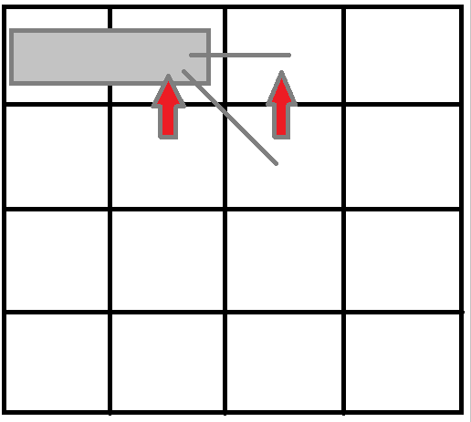
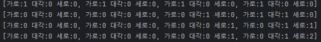
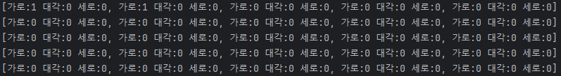

# 파이프 옮기기
<br>
왼쪽, 대각, 위 방향에서 올 수 있습니다. 길찾기 문제 처럼 각각의 위치(이전위치)를 합산한 결과를 저장하면 될 것 같습니다.<br>
<br>
<br>
하지만 올 수있는 방향이 45도만 회전이 가능하기 때문에 이을 수 있는 방향이 항상 정해져 있습니다.<br>

따라서 대각선 방향은 모든 모양의 파이프에서 이을 수 있고, 가로는 가로, 대각, 세로는 세로 대각선에서만 이을 수 있습니다.<br>
이러한 점화식을 코드로 옮겨 본다면 다음과 같습니다.
```java
/**
 * 0 : 가로
 * 1 : 대각선
 * 2 : 세로
 * */
dp[i][j].direction[1] = dp[i-1][j-1].direction[0] + dp[i-1][j-1].direction[1] + dp[i-1][j-1].direction[2];
dp[i][j].direction[2] = dp[i-1][j].direction[1] + dp[i-1][j].direction[2];
dp[i][j].direction[0] = dp[i][j-1].direction[0] + dp[i][j-1].direction[1];
```
한번 실행을 해 보면 아래와 같이 잘 작동되는것을 볼 수 있습니다.
<br>
이 문제에서는 벽이 주어지게 되는데요
그렇기 때문에 continue를 이용하여 벽이 있으면 건너 뜁니다.
```
if (map[i][j]) continue;
```
<br>
건너 뛰게 된다면 해당 위치를 갱신하지 않기 때문에 이후의 배열에서또한 갱신이 되지 않습니다. <br>
이것으로 끝이면 좋겠지만 끝이 아닌데요
### "벽에는 새로운 벽지를 발랐기 때문에, 파이프가 벽을 긁으면 안 된다. 즉, 파이프는 항상 빈 칸만 차지해야 한다."
라는 규칙이 있기 때문에 대각선인 경우 가로, 대각, 세로에 벽이 있으면 안됩니다.
```
if (!map[i-1][j-1] && !map[i-1][j] && !map[i][j-1])
```
해당 코드를 추가 해서 예외처리를 해 주었습니다.